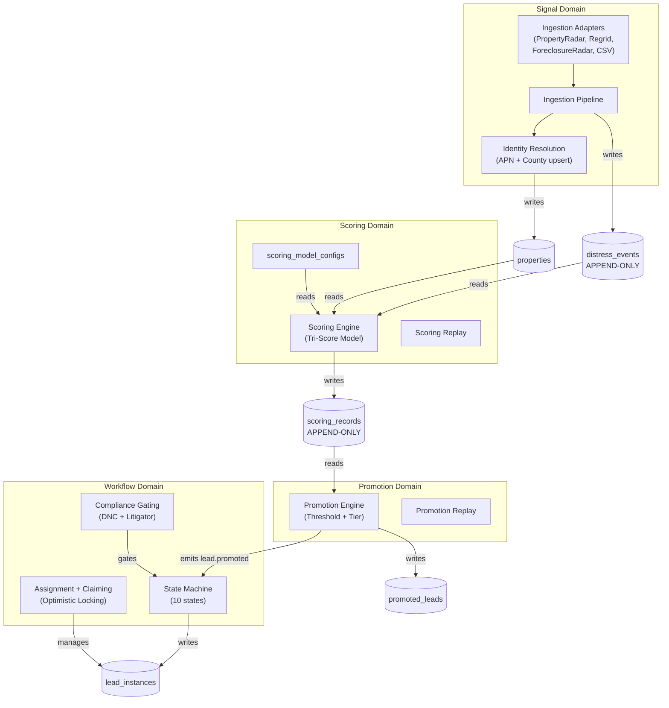
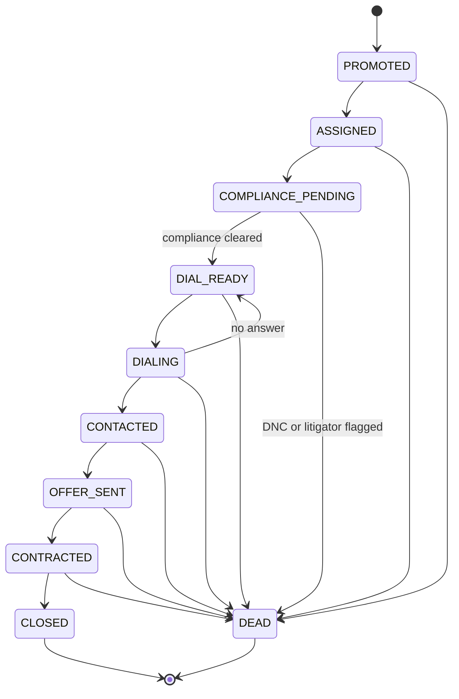

# Dominion Ranger — Architecture

## System Overview

Dominion Ranger is a deterministic acquisition operating system for real estate distress detection and lead intelligence. It ingests distress signals from multiple data sources, scores properties using a config-driven tri-score model, promotes high-scoring leads through a threshold engine, and manages the acquisition lifecycle through a stateful workflow with compliance gating.

The system prioritizes **permanence**, **determinism**, and **rewrite resistance** over speed of feature delivery.

## Tech Stack

| Layer | Technology |
|-------|-----------|
| Runtime | Node.js 20+, TypeScript 5.7, ESM |
| API | Fastify 5 |
| ORM | Drizzle ORM 0.36 + drizzle-kit |
| Database | PostgreSQL (Neon serverless) |
| Queue | BullMQ 5 + ioredis (Upstash Redis) |
| Validation | Zod |
| Testing | Vitest |
| Logging | Pino |
| CI | GitHub Actions |

## Domain Boundary Diagram



## 7 Non-Negotiable Invariants

| # | Invariant | Enforcement |
|---|-----------|-------------|
| 1 | `distress_events` is append-only | PostgreSQL BEFORE UPDATE/DELETE triggers raise exception |
| 2 | `scoring_records` is append-only | PostgreSQL BEFORE UPDATE/DELETE triggers raise exception |
| 3 | Scoring version always preserved | Every `scoring_records` row stores `score_model_version`; old rows never modified |
| 4 | Identity separation enforced | `properties` = permanent identity (APN+County), `lead_instances` = temporal lifecycle |
| 5 | Idempotent ingestion guaranteed | ON CONFLICT DO UPDATE for properties, ON CONFLICT DO NOTHING for events (fingerprint dedup) |
| 6 | Deterministic replay possible | Same events + same config = identical scores and promotions, no randomness |
| 7 | Compliance gating before dial | DNC + litigator checks required before any lead enters dial queue |

## Lead Instance State Machine



**Terminal states:** CLOSED (successful acquisition), DEAD (disqualified/dropped)

**Concurrency protection:** All transitions use optimistic locking via `version` column. Two concurrent claims on the same lead result in exactly one success.

## Directory Structure

```
dominion-ranger/
├── .github/workflows/ci.yml    # CI pipeline (lint, typecheck, test, migration check)
├── src/
│   ├── api/                     # Fastify HTTP routes (thin — delegates to services)
│   │   ├── middleware/auth.ts
│   │   └── routes/              # 7 route files
│   ├── config/                  # Environment, logging
│   ├── db/
│   │   ├── schema/              # 11 Drizzle table definitions
│   │   ├── seeds/               # Scoring model v1.0 seed
│   │   ├── migrations/          # 4 SQL migration files (0000–0003)
│   │   ├── invariants.ts        # Append-only trigger application
│   │   └── connection.ts
│   ├── events/                  # Domain event bus + wiring
│   ├── ingestion/               # Signal domain — adapters + pipeline
│   │   └── adapters/            # PropertyRadar, Regrid, ForeclosureRadar, REISkip
│   ├── jobs/                    # BullMQ queues + workers
│   ├── lib/                     # Shared utilities (address, dates, ids, fingerprint, errors)
│   ├── modules/                 # Domain services
│   │   ├── compliance/          # DNC, litigator, audit logging
│   │   ├── distress-events/     # Event store (append-only)
│   │   ├── promotion/           # Threshold evaluation, replay
│   │   ├── properties/          # Identity resolution, atomic upsert
│   │   ├── scoring/             # Tri-score engine, replay
│   │   ├── signals/             # Signal accumulation
│   │   └── workflow/            # Lead instance lifecycle
│   └── scripts/                 # CLI tools (CSV reimport)
├── tests/
│   ├── unit/                    # 6 test files, 89 tests
│   ├── integration/             # 6 test files (require Postgres)
│   └── helpers/test-db.ts
└── docs/                        # Schema, replay guide, migration history
```

## Scoring Model v1.0

- **Motivation Score**: Weighted sum of distress event contributions with exponential time decay
- **Deal Score**: Property economics (equity, ownership duration, absentee status, mortgage severity)
- **Composite Score**: `(motivation * motivation_weight + deal * deal_weight) * equity_multiplier`
- Weights, thresholds, multipliers, and suppression rules stored in `scoring_model_configs` table
- Promotion threshold: 40 (composite score)
- Tiers: A >= 80, B >= 60, C >= 40
